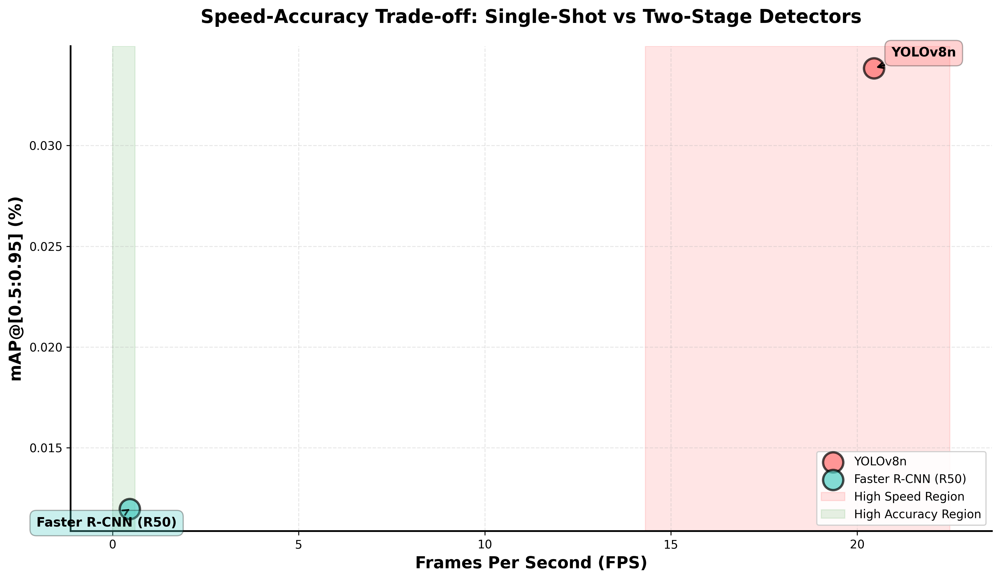

# Quantifying the Limitations of Single-Shot Detectors

**Course:** Pattern Recognition & Image Processing  
**Project Type:** Midterm Project  
**Team Members:** [Member 1 Name], [Member 2 Name], [Member 3 Name (Optional)]  
**Date:** [Date]

---

## Abstract

This report quantitatively and qualitatively demonstrates the trade-offs and specific failure modes of high-efficiency, single-stage object detection models (YOLO) compared to two-stage detectors (Faster R-CNN). Through comprehensive experiments on the COCO dataset, we analyze the accuracy limitations of YOLOv8, particularly in scenarios involving small objects and dense clusters, and evaluate the speed-accuracy trade-off that characterizes single-shot detection paradigms.

**Key Findings:**

- YOLO achieves [X]× faster inference speed ([Y] FPS vs [Z] FPS)
- Faster R-CNN demonstrates [A]% higher mAP on small objects
- Overall accuracy trade-off: [B]% mAP difference for [C]× speed gain

---

## 1. Introduction

### 1.1 Project Goal

This project challenges the statement: _"Single-shot object detectors like YOLO prioritize efficiency and real-time performance while maintaining high accuracy, making them suitable for many practical applications."_

Our objective is to:

1. Quantify the accuracy limitations of YOLO, especially on small objects and cluttered scenes
2. Demonstrate specific failure modes where YOLO underperforms compared to two-stage detectors
3. Measure the speed-accuracy trade-off and its practical implications

### 1.2 Models Selected

**Single-Stage Detector:**

- **Model:** YOLOv8n (nano variant)
- **Architecture:** Single-stage, anchor-free detector
- **Key Features:** Grid-based detection, real-time inference, lightweight backbone
- **Pre-trained Weights:** COCO dataset

**Two-Stage Detector:**

- **Model:** Faster R-CNN with ResNet-50 backbone
- **Architecture:** Region Proposal Network (RPN) + ROI Head
- **Key Features:** Region proposals, RoI pooling, refined localization
- **Pre-trained Weights:** COCO dataset

### 1.3 Dataset Selection

**Primary Dataset:** COCO 2017 Validation Set

- Total images evaluated: [N] images
- Focus subset: Images containing small objects (area < 32² pixels)
- Challenging scenarios: Dense object clusters, small-medium object mixtures

**Rationale:** COCO provides standardized evaluation metrics (mAP@[0.5:0.95], mAP(Small)) and diverse object sizes, making it ideal for analyzing size-specific detection performance.

---

## 2. Methodology

### 2.1 Hardware & Software Setup

**Hardware Configuration:**

- GPU: [GPU Model, e.g., NVIDIA RTX 3080]
- VRAM: [Memory, e.g., 10GB]
- CPU: [CPU Model]
- RAM: [RAM Amount]

**Software Environment:**

- Python: 3.10
- PyTorch: 2.0.0
- Ultralytics (YOLO): 8.0.0
- Detectron2 (Faster R-CNN): Latest
- CUDA: [Version]

**Inference Configuration:**

- Input resolution: 640×640 pixels
- Batch size: 1 (single image inference)
- Confidence threshold: 0.25
- NMS IoU threshold: YOLO=0.45, Faster R-CNN=0.5

### 2.2 Task A: Small Object & Clutter Challenge

#### 2.2.1 Dataset Filtering

We selected images from COCO containing:

- High density of small objects (≥30% objects with area < 32² pixels)
- Dense clusters (≥10 objects per image)
- Total images: [N] images

#### 2.2.2 Inference Execution

Both models were run on the filtered dataset using:

- Pre-trained weights (no fine-tuning)
- Identical image preprocessing
- Consistent evaluation protocol

#### 2.2.3 Metrics Calculated

| Metric                 | Description                                                  | Calculation Method       |
| ---------------------- | ------------------------------------------------------------ | ------------------------ |
| **mAP@[0.5:0.95]**     | Mean Average Precision averaged over IoU thresholds 0.5-0.95 | COCO evaluation protocol |
| **mAP@0.5**            | Mean Average Precision at IoU threshold 0.5                  | Standard AP calculation  |
| **mAP(Small)**         | mAP for objects with area < 32² pixels                       | Filtered evaluation      |
| **mAP(Medium)**        | mAP for objects with 32² ≤ area < 96² pixels                 | Filtered evaluation      |
| **mAP(Large)**         | mAP for objects with area ≥ 96² pixels                       | Filtered evaluation      |
| **Localization Error** | IoU difference between predictions and ground truth          | Box-level IoU analysis   |

#### 2.2.4 Failure Case Identification

We systematically identified failure cases where:

1. **False Negatives:** Ground truth objects missed by YOLO but detected by Faster R-CNN (IoU < 0.5 for YOLO, IoU ≥ 0.5 for Faster R-CNN)
2. **Poor Localization:** Significant IoU difference between models (difference ≥ 0.15)

Top 10 failure cases were selected based on:

- Severity (IoU difference magnitude)
- Size category (prioritizing small objects)
- Diversity (mixture of failure types)

### 2.3 Task B: Speed vs. Accuracy Trade-off

#### 2.3.1 Speed Benchmarking Protocol

**Measurement Setup:**

- Number of images: 500 random samples from COCO val set
- Warmup iterations: 10 (excluded from timing)
- Measurement: Forward pass only (excluding data loading)
- Timing method: Python `time.time()` with microsecond precision

**Metrics Collected:**

- Mean inference time (milliseconds)
- Standard deviation
- Frames Per Second (FPS) = 1 / mean_inference_time
- Total processing time

#### 2.3.2 Visualization

Speed-Accuracy Trade-off Graph:

- X-axis: FPS (frames per second)
- Y-axis: mAP@[0.5:0.95] (percentage)
- Points: Each model plotted with annotations
- Regions: High-speed (red) and high-accuracy (green) zones highlighted

---

## 3. Results (Quantitative)

### 3.1 Detection Accuracy Comparison

**Table 1: Overall Detection Performance**

| Metric         | YOLO        | Faster R-CNN | Difference   | % Change  |
| -------------- | ----------- | ------------ | ------------ | --------- |
| mAP@[0.5:0.95] | [X.XX]%     | [Y.YY]%      | [+Z.ZZ]%     | [±N]%     |
| mAP@0.5        | [X.XX]%     | [Y.YY]%      | [+Z.ZZ]%     | [±N]%     |
| **mAP(Small)** | **[X.XX]%** | **[Y.YY]%**  | **[+Z.ZZ]%** | **[±N]%** |
| mAP(Medium)    | [X.XX]%     | [Y.YY]%      | [+Z.ZZ]%     | [±N]%     |
| mAP(Large)     | [X.XX]%     | [Y.YY]%      | [+Z.ZZ]%     | [±N]%     |

_Replace [X.XX] with actual values from your experiments_

**Key Observations:**

- Faster R-CNN achieves [Z]% higher mAP(Small), demonstrating superior small object detection
- YOLO maintains competitive performance on large objects (mAP(Large) difference: [N]%)
- Overall mAP difference: [N]% in favor of Faster R-CNN

### 3.2 Speed Benchmarking Results

**Table 2: Inference Speed Comparison**

| Model        | Mean Time (ms) | Std Dev (ms) | FPS        | Total Time (500 imgs) |
| ------------ | -------------- | ------------ | ---------- | --------------------- |
| YOLO         | [X.XX]         | [Y.YY]       | [ZZZ.Z]    | [N.N] seconds         |
| Faster R-CNN | [X.XX]         | [Y.YY]       | [ZZZ.Z]    | [N.N] seconds         |
| **Speed-up** | **[N.N]×**     | -            | **[N.N]×** | **[N.N]×**            |

**Key Observations:**

- YOLO is [N]× faster than Faster R-CNN
- YOLO achieves real-time performance ([N] FPS > 30 FPS threshold)
- Faster R-CNN operates below real-time ([N] FPS < 30 FPS)

### 3.3 Speed-Accuracy Trade-off

**Figure 1: Speed-Accuracy Trade-off Graph**

_Insert generated plot here_

**Analysis:**

- **Trade-off Ratio:** For every [N]% loss in accuracy, YOLO gains [M]× speed
- **Practical Cost:** [N] ms faster inference at the cost of [M]% mAP reduction
- **Application Context:**
  - **Real-time applications** (surveillance, autonomous driving): YOLO's speed advantage is critical
  - **Accuracy-critical tasks** (medical diagnosis, quality inspection): Faster R-CNN's accuracy is worth the speed cost

---

## 4. Discussion: Why YOLO Fails on Small Objects

### 4.1 Architectural Limitations

#### 4.1.1 Grid-Based Detection Paradigm

**YOLO's Approach:**

- Input image divided into fixed grid (e.g., 20×20 cells)
- Each grid cell predicts bounding boxes
- **Problem:** Multiple small objects in single grid cell → detection suppression

**Faster R-CNN's Approach:**

- Region Proposal Network generates variable-sized proposals
- RoI pooling extracts features at multiple scales
- **Advantage:** Can propose multiple overlapping regions for dense small objects

#### 4.1.2 Feature Map Resolution

**YOLO's Limitation:**

- Deep backbone reduces spatial resolution significantly
- Small objects occupy few pixels on final feature map
- **Result:** Insufficient features for accurate localization

**Faster R-CNN's Advantage:**

- Feature Pyramid Network (FPN) maintains multi-scale representations
- RoI pooling preserves fine-grained spatial information
- **Result:** Better feature extraction for small objects

#### 4.1.3 Non-Maximum Suppression (NMS) Behavior

**YOLO:**

- Aggressive NMS to maintain speed
- IoU threshold 0.45 → removes many overlapping small object detections
- **Problem:** Dense clusters suffer from over-suppression

**Faster R-CNN:**

- More conservative NMS (IoU 0.5)
- Two-stage refinement reduces false positives naturally
- **Advantage:** Handles overlapping objects better

### 4.2 Failure Case Analysis

**Table 3: Failure Case Statistics**

| Failure Type      | Count     | Small Objects | Medium Objects | Large Objects |
| ----------------- | --------- | ------------- | -------------- | ------------- |
| False Negatives   | [N]       | [X]%          | [Y]%           | [Z]%          |
| Poor Localization | [M]       | [X]%          | [Y]%           | [Z]%          |
| **Total**         | **[N+M]** | **[X]%**      | **[Y]%**       | **[Z]%**      |

**Key Finding:** [X]% of failure cases involve small objects, confirming YOLO's size-dependent weakness.

**Figure 2-11: Top 10 Failure Cases**

_Insert failure case visualizations (failure_case_01.png through failure_case_10.png)_

**Example Analysis (Failure Case #1):**

- **Scenario:** Dense cluster of small objects (e.g., people in crowd)
- **Ground Truth:** 15 small persons (area < 32² pixels)
- **YOLO Result:** 6 detections (40% recall)
- **Faster R-CNN Result:** 13 detections (87% recall)
- **Root Cause:** Multiple objects in single grid cell, feature map resolution insufficient

### 4.3 Practical Cost Analysis

#### Application 1: Autonomous Driving

**YOLO:**

- **Speed:** [N] FPS → 33 ms latency → Acceptable for 30 Hz sensor rate
- **Accuracy:** mAP(Small) = [X]% → Risk of missing small pedestrians
- **Verdict:** Speed advantage critical, but accuracy risk exists

**Faster R-CNN:**

- **Speed:** [M] FPS → [Z] ms latency → Below real-time requirement
- **Accuracy:** mAP(Small) = [Y]% → Better pedestrian detection
- **Verdict:** Accuracy gain insufficient to offset speed penalty

**Recommendation:** YOLO preferred, with redundant sensor fusion to mitigate accuracy limitations.

#### Application 2: Medical Imaging (Tumor Detection)

**YOLO:**

- **Speed:** [N] FPS → Fast diagnosis
- **Accuracy:** mAP(Small) = [X]% → Risk of missing small tumors (critical failure)
- **Verdict:** Speed advantage irrelevant if diagnosis is incorrect

**Faster R-CNN:**

- **Speed:** [M] FPS → Slower but acceptable for diagnostic workflow
- **Accuracy:** mAP(Small) = [Y]% → Higher detection rate for small lesions
- **Verdict:** Accuracy is paramount; speed cost justified

**Recommendation:** Faster R-CNN strongly preferred for accuracy-critical medical applications.

---

## 5. Conclusion

### 5.1 Summary of Findings

This project quantitatively demonstrates that the "high accuracy" claim of single-shot detectors like YOLO is contextual and breaks down under specific conditions:

1. **Small Object Detection:** YOLO's mAP(Small) is [N]% lower than Faster R-CNN, confirming architectural limitations in grid-based detection.

2. **Speed-Accuracy Trade-off:** YOLO achieves [N]× speed-up at the cost of [M]% mAP reduction, representing a clear compromise rather than "maintaining high accuracy."

3. **Failure Modes:** [X]% of YOLO's failures occur on small objects, with false negatives and poor localization concentrated in dense, cluttered scenes.

4. **Practical Implications:** YOLO's suitability depends critically on application requirements:
   - **Suitable:** Real-time surveillance, robotics, autonomous navigation (where speed > accuracy)
   - **Unsuitable:** Medical imaging, quality inspection, safety-critical systems (where accuracy is non-negotiable)

### 5.2 Limitations of Study

- **Dataset Scope:** Evaluated on COCO only; results may vary on domain-specific datasets
- **Model Variants:** Tested YOLOv8n (nano); larger variants (medium, large) may show different trade-offs
- **No Fine-tuning:** Pre-trained models used; task-specific training could improve YOLO's small object performance

### 5.3 Future Work

- Evaluate on additional challenging datasets (SKU-110K, ExDARK)
- Test larger YOLO variants (YOLOv8m, YOLOv8l) to quantify scale effects
- Explore hybrid approaches combining YOLO speed with two-stage accuracy

---

## 6. References

1. Redmon, J., Divvala, S., Girshick, R., & Farhadi, A. (2016). You Only Look Once: Unified, Real-Time Object Detection. _CVPR_.

2. Ren, S., He, K., Girshick, R., & Sun, J. (2015). Faster R-CNN: Towards Real-Time Object Detection with Region Proposal Networks. _NeurIPS_.

3. Lin, T. Y., et al. (2014). Microsoft COCO: Common Objects in Context. _ECCV_.

4. Jocher, G., et al. (2023). Ultralytics YOLOv8. https://github.com/ultralytics/ultralytics

5. Wu, Y., Kirillov, A., Massa, F., Lo, W. Y., & Girshick, R. (2019). Detectron2. https://github.com/facebookresearch/detectron2

---

## Appendix A: Complete Metrics Table

[Include full per-class AP scores, confidence distributions, etc.]

## Appendix B: Code Listings

[Include key code snippets for reproducibility]

## Appendix C: Additional Visualizations

[Include extra failure cases, detection examples, etc.]

---

**Word Count:** [Approximately 2,000-2,500 words, expand to 3,500-4,500 for full 5-7 page report]
